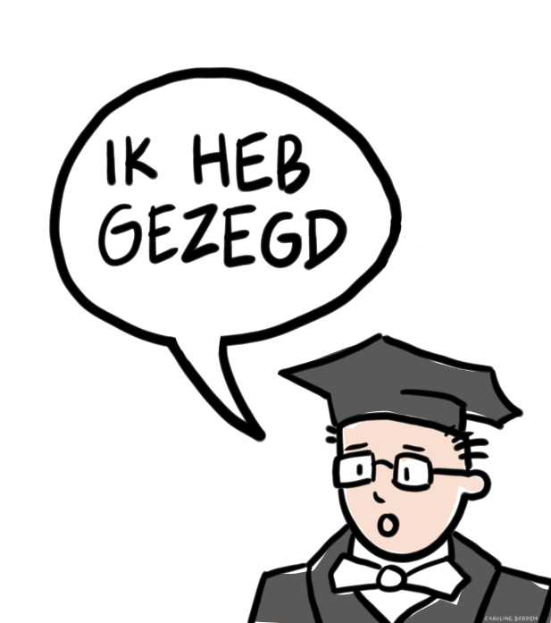

# Words of Gratitude {.unnumbered}

As in healthcare, progress in research and writing is never a solo endeavor. Before concluding, I would like to express my appreciation to those who have contributed -directly and indirectly- to this text.

First, my sincere thanks to Tanya Bondarouk, dean of our faculty, and to Erik Koffijberg and Erwin Hans for giving me the opportunity to start this chair at the University of Twente. Tanya makes me feel at home at the university and in Twente. Her kindness and genuine interest mean a lot to me. Erik brings structure, sharp thinking, and a calm, thoughtful presence. I continue to learn a great deal from him. Erwin impresses me not only with his intelligence and dedication to creating real-world impact, but also with his good nature, great sense of humor, and the strong, close-knit group he has built. He’s a true inspiration, especially when it comes to teaching.

As this lecture has shown, Health Systems Engineering is a complex task, one that I certainly cannot undertake alone. Improving healthcare requires multidisciplinary collaboration, not only between providers, welfare organizations, and payers but also across academic fields.

In that spirit, I want to acknowledge my closest colleagues: Shiva Faeghinezhad, Anoukh van Giessen, Lieke Heesink, Marc Heinle and Youssef Elwan for their dedication to developing this field with me. Their insights, enthusiasm, and critical perspectives make this work not just possible, but deeply rewarding.

Before coming to Twente, I spent a wonderful period at the Dutch Healthcare Authority (NZa). It was with pain in my heart that I decided to leave. I'm fortunate to still collaborate with the NZa. There are too many of ex-colleagues to mention by name, so I won’t mention anyone, as I wouldn’t want to prioritize.

I’m also thankful for my time at Tilburg University. I learned much during those years and look forward to continuing collaboration, with Jan Boone, Tobias Klein, and Martin Salm in particular.

To all my colleagues at HTSR and there are many of them, it’s truly a pleasure to work alongside such a talented and dedicated group. I greatly value our collaboration in teaching, research, and student supervision, and I look forward to continuing these efforts together.

A special word of thanks to Ingrid de Kaste-Krisman, the social cement of our section. Beyond ensuring everything runs smoothly day to day, she has played a key role in organizing the inaugural address. Her support, warmth, and attention to detail are invaluable. I’m truly grateful to her.

I would like to thank Caroline Berden for our inspiring and ongong research cooperation, as well as for her beautiful design of the book cover and the visual summary of the inaugural lecture.

My thanks also go to Edwin van der Meer and Marjolein Bruning from Beter Samen in Noord. Thier work has been a true inspiration in translating ideas into action. As we've seen in this text, real change happens not just in theory but in practice and their efforts in Amsterdam-Noord embody that spirit.

I want to acknowledge Wijbrand Bins, a mentor who left a lasting mark on my thinking and my work. Sadly, he is no longer with us, but his influence remains.

I’m grateful to all my co-authors and PhD students, some of whom have graduated, others I still work with. Our collaborations are intellectually stimulating and personally enriching. I learn from each of them, and their perspectives challenge and inspire me. While I can't name everyone, I want to thank my first-ever co-author and dear friend Victoria Shestalova in particular. We began working together in 2000, and our long-standing collaboration is built on trust, curiosity, and laughter.

I also want to thank Steven Bakker and Denise Maas, not for professional reasons, but simply for being my friends. 

I am deeply grateful to Peter Bogetoft, my PhD supervisor, and more than that, my hero. He shaped my thinking in ways that go far beyond academia, and I carry those lessons with me every day.

I want to thank my parents. It saddens me that my father could not be here today, he passed away recently, and I miss him dearly. I’m grateful we had the chance to discuss this lecture’s content before his passing. It means a great deal to me that my mother attended the inaugural lecture. I want to thank her for her unwavering support.

I grew up in a warm and supportive family: a family my parents built with attention, care, and love. Throughout my life, my brothers have been a sounding board and a source of inspiration. I thank Duco for our conversations on education and mathematics, and Merlijn for his continuous lessons in bouldering and in life. He also contributed to this inaugural address with discussions, critical questions and ideas during our shared work and climbing trip in Fontainebleau.

To my sons Arvid, Finn, and Silas: they inspire me in ways they may not even realize. Though each of they has chosen a unique path, our conversations, politics, science, art, and sports are a constant source of learning and reflection. Finn contributed to the inaugural lecture as a research assistant. I am incredibly proud of each of them. Not just for what they do, but for who they are.

And finally, to Sandra Kompier, the love of my life. Her support, patience, and clear-sighted thinking ground me more than she knows. She does not only bring warmth and kindness, but also a deep curiosity about the world that enriches our life together. I treasure the conversations we share, serious and lighthearted alike, and I’m deeply grateful to walk through life with her.

{fig-align="center" width="50%"}
